# 22 Agustus 2022 (React JS Hooks)
## Hooks 
adalah fitur baru yang baru dikenalkan di react js pada tahun 2018
jadi intinya yaitu yntyk memudahkan penggunakaan functional components agar bisa digunakan state dan lifecycle lainya

Namun sebelumnya ,state (setstate dab lifecycle hanya digunakan di class component, namun dengan hooks, kita bisa menggunakanya di functional component.

hooks yang sering digunakan adalah useState, dan useEffect, kedua hal ini sama hal nya dengan state dan lifecycle di class yang sering digunakan 

ketika ada usesState dan useEffect yaitu ada proses penggolahan data 

### ilustrasi Hooks

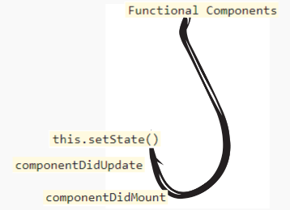

dari penjelasan  diatas yaitu functional componen akan melakukan "hooks" terhadap hal-hal yang hanya di class agar bisa digunakan di functional componens dengan mudah.

## perbedaan dengan class

kedua komponen ini, akan menghasilkan hal yang sama namun class menggunakan state dan fuctional mengunakan state hooks

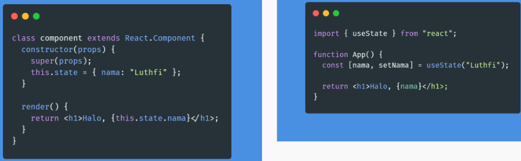

maka hasilnya tetap sama seperti dibawah ini 

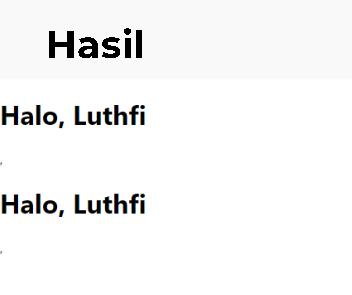

## kelebihan menggunakan hooks
1. penulisannya code lebih simpel, rapih dari
pada menggunakan class component
2. lebih mudah dimengerti
3. team react sudah merekomendasikan untuk menggunakan hook ini karena lebih unggul

## useState
merupahan hooks  yang bersifat setState pada class component namun definisinya sama hanya perbedaan pada code saja 

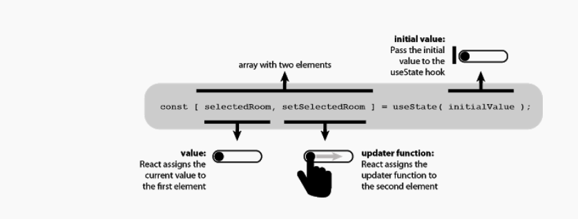

pejelasan gambar diatas :
1. `selectedRoom` disebut dengan variabel value
2. `setSelectedRoom` update function yang berfungsi untuk mengpdate data dari sebuah value
3. `useState` disebut dengan inisial value

## cara menggunakan useState

import useState dari react

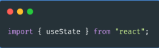

menuliskan useState hooks

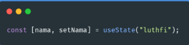

panggil data

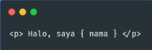

lakukan update state

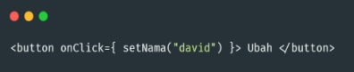

maka full codenya seperti gambar dibawah ini 

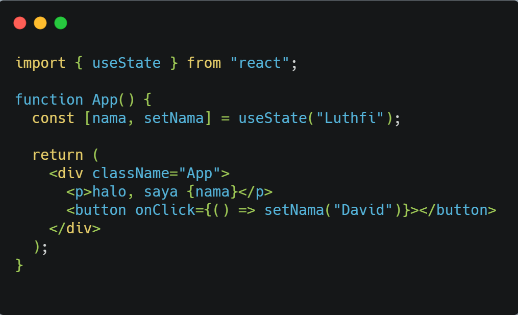

maka hasilnya seperti dibawah ini 

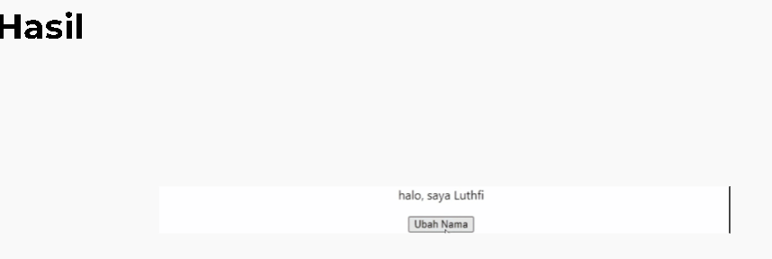

## Update State
state bisa di ubah menggunakan variabel kedua dari state hooks, contohnya apabila kita menggunakan seperti code dibawahini 

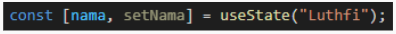

maka kita mengunakan setNama () untuk mengupdate

maka full codenya akan seperti ini 

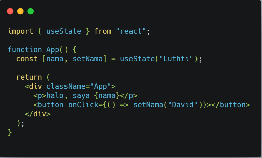

maka hasinya seperti dibawah ini

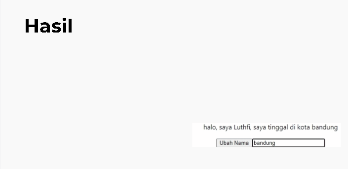

# 23 Agustus 2022 (Router)
merupakan standar rooting untuk membuat sebuah web yang jauh dinamis. atau sebagai baltary untuk mengarahkan dari page 1 ke page lain berdasarlkan page url yang kita tentukan 

## react router versi 6

## Instalasi Dasar 
Untuk menambahkan React Router ke proyek yang sudah ada, hal pertama yang harus kita lakukan adalah menginstal dependensi yang diperlukan dengan alat pilihan kita :
1. buka Terminal laku klik kode `npm install react-router-dom@6`
2. Setelah proyek kita diatur dan React Router diinstal sebagai dependensi, buka src/index.js di editor teks Anda. Impor BrowserRouterdari react-router-domdekat bagian atas file Anda dan bungkus aplikasi Anda dalam `<BrowserRouter>`
dengan Printah Dibawah ini 

        import * as React from "react";
        import ReactDOM from "react-dom/client";
        import { BrowserRouter } from "react-router-dom";
        import "./index.css";
        import App from "./App";
        import reportWebVitals from "./reportWebVitals";

        const root = ReactDOM.createRoot(
                document.getElementById("root")
        );
        root.render(
                <React.StrictMode>
                <BrowserRouter>
                <App />
                </BrowserRouter>
                </React.StrictMode>
        );
3. Sekarang Anda dapat menggunakan React Router di mana saja
## <BrowserRouter>
        <BrowserRouter>adalah antarmuka yang direkomendasikan untuk menjalankan React Router di browser web. A <BrowserRouter>menyimpan lokasi saat ini di bilah alamat browser menggunakan URL bersih dan bernavigasi menggunakan tumpukan riwayat bawaan browser.

## HeshRouter
        <HashRouter>adalah untuk digunakan di browser web ketika URL tidak boleh (atau tidak dapat) dikirim ke server karena alasan tertentu. Ini mungkin terjadi di beberapa skenario hosting bersama di mana Anda tidak memiliki kontrol penuh atas server. Dalam situasi ini, <HashRouter> memungkinkan untuk menyimpan lokasi saat ini di hashbagian URL saat ini, sehingga tidak pernah dikirim ke server.

## <MemoryRouter>
        menyimpan lokasinya secara internal dalam array. Tidak seperti <BrowserHistory>dan <HashHistory>, itu tidak terikat ke sumber eksternal, seperti tumpukan riwayat di browser. Ini membuatnya ideal untuk skenario di mana Anda memerlukan kontrol penuh atas tumpukan riwayat, seperti pengujian.

# 24 Agustus 2022 (Redux)
adalah salah satu labrary state manajemen dalam arti state manajemen adalah proses mengelolah suatu informasi atau data dari berbagai data dari suatu aplikasi

dalam react js sendiri untuk mendahkan dari componen a ke b yaitu menggunakan state manajemen 

namun bebrirngan waktu state manajemen melakukan pekembangann yaitu context

dengan adanya state manajemen kita dapat di bantu untuk impor dengan mudah tampak melakukan proses yang lebih panjang dan memudahkan component lain dapat di olah oleh component lain

contoh menggunakan state manajemen yaitu dark mode dan light mode

## redux
        tantangan dari redux cocok untuk aplikasi yang kompleks,

cara kerja redux
1. Action adalah sebuah function yang mereturn sebuah objek. Objek tersebut memiliki sebuah property wajib yaitu type. Type inilah yang menentukan bagaimana statenya akan diubah. 
2. Reducer adalah sebuah fungsi yang tugasnya untuk mengolah state yang ada di store. Misal menambah data, menghapus data, mengambil data, dsb. Ada 2 parameter wajib dari reducer, yaitu state dan action.
3. Store adalah tempat untuk menampung state. Jadi store ibarat database untuk frontend. Alur kerjanya seperti berikut:

- Pertama akan ada triger dari UI
- Kemudian akan ke action
- Dari action reducer akan mengubah state yang sesuai dengan type dari action tadi
- Terahir update UI lagi

# 25 Agustus 2022 ( lanjutan Redux (state manajemem))

cara menjalankan redux 
1. create projek 
2. install package/ dependecies yang dibutuhkan:

        ## Core 
        1.  redux
        2.  react redux
        3.  redux-devtools-extension

        ## Additional
        4. npm install react-router-dom@6

        commend install :

        npm install redux react-redux redux-devtools-extension

3. Membuat folder dengan store didalam folder dibuat lagi 2 folder dan 1 file diantaranya

        1. Folder actions
        2. Folder Reducers
        3. File 'store.js'

4. menambahkan 1 file core dengan index.js di dalam folder **action**
5. pada folder **action** tambahkan action interface yang dibutuhkan 
6.  menuliskan code pada action interface yang dibutuhkan  (seperti pada gambae dibawah ini )

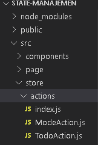

7. menambahkan 1 file core dengan  index.js didalam folder **reducer**
8. pada folder **reducer** tambahkan file sesuai yang dibutuhkan (seperti pada gambar dibawah ini)

 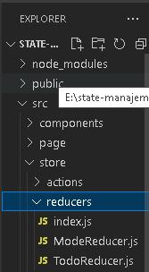

9. pada `store.js` import core method **createStore**
10. Pada file index.js yang terdapat di root project src

